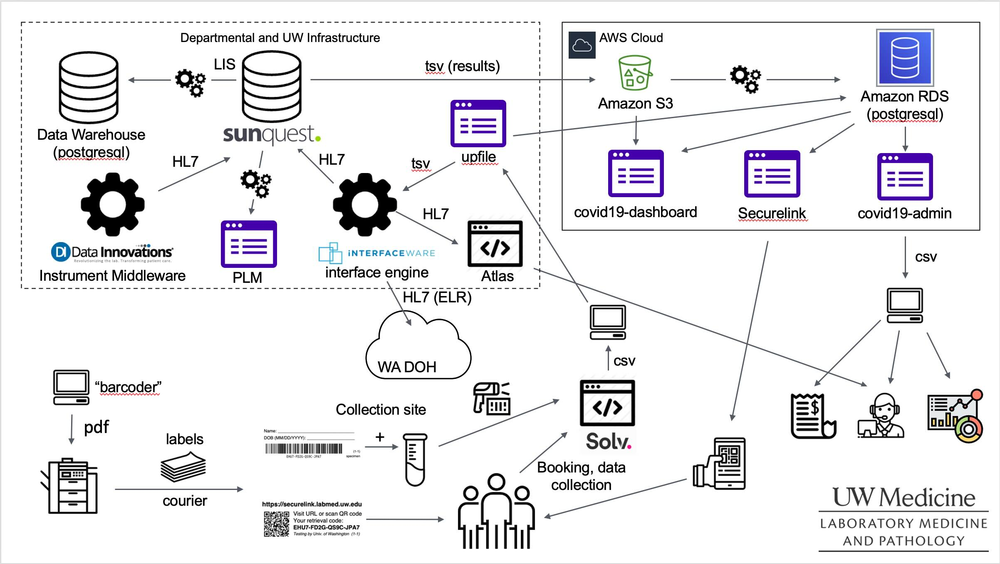
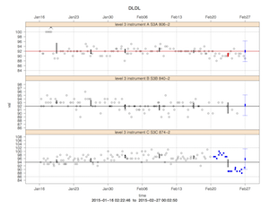

Title: Software
page-order: 40

Here is some software that I have either authored or contributed
significantly to. Some of these projects are hosted publicly under the
user name "[nhoffman](https://github.com/nhoffman)" on GitHub - </img> icons below link to individual
repositories.

[TOC]

# Generative AI

Since around 2024, I have (along with everyone else) developed an
interest in Generative AI and Large Language Models (LLMs) for use
cases in healthcare and the clinical laboratory medicine. I have
partnered with [Nik Krumm](https://dlmp.uw.edu/faculty/krumm) to
develop departmental infrastructure for providing secure,
HIPAA-compatible access to foundation models.

## UW Medicine Chat App

The [UW Medicine Chat App](https://chat.uwmedicine.org) (UW Medicine
access only) provides secure,
[HIPAA-compliant](https://depts.washington.edu/uwmed-chat/use_cases.html)
access to OpenAI GPT-series models for all UW Medicine users. As of
early 2026, the Chat App is the only approved, generally-available
environment for using LLMs with PHI and other sensitive data (see the
[list of approved resources](https://vitals.uwmedicine.org/site/18e5cedf-89ff-435c-a172-24d47f4da540/page/1c3f1da7-bbb1-4a28-9e04-64c844e13cf3) on UW Medicine Vitals). Also see
[these](https://vitals.uwmedicine.org/site/18e5cedf-89ff-435c-a172-24d47f4da540/page/1c3f1da7-bbb1-4a28-9e04-64c844e13cf3)
[pages](https://vitals.uwmedicine.org/site/18e5cedf-89ff-435c-a172-24d47f4da540/page/bfeec1a5-1f8f-42bf-a09b-2d39377d9388)
on Vitals for additional communication to UW Medicine users. Developed in partnership with Nik Krumm.

## DLMP Chatbot

Like the Chat App, the [DLMP Chatbot](https://chatbot.dlmp.uw.edu)
(DLMP access only) provides secure access to foundation LLMs hosted on
Azure OpenAI and Amazon Bedrock (eg, Anthropic's Claude models). It is
hosted on the same infrastructure, but is developed separately to
allow development of features for departmental users. The user-facing
application is an instance of [Open WebUI](https://openwebui.com).
Developed in partnership with Nik Krumm.

## Docsearch

A system for searching and interrogating laboratory policies and
procedures using Retrieval Augmented Generation (RAG). Uses postgresql
with pgvector to implement hybrid search.

## Toolbuilder

The OpenAI function calling API provides a specification for
extracting details from text and representing the outputs in a json
object. This is very useful in situations where you want to provide
the extracted features to a downstream process for analysis.

The purpose of this Streamlit application is to provide a user
interface for composing a tool specification to perform a specific
data extraction task. Note the option to load example data to
demonstrate the application. A demonstration version is available [on
streamlit](https://toolbuilder.streamlit.app) (requires OpenAI API
key).

Written to accompany the publication Foy BH, Smith KD, Vargas OL,
Keebaugh M, Lu L, Patel AA, Akilesh S, and <u>Hoffman
NG</u>. <strong>Evaluation of Large-Language Models for Structured
Feature Extraction of Anatomic and Clinical Pathology
Reports.</strong> <em>Clin Chem.</em> 2026 Feb 12; <a
href="https://pubmed.ncbi.nlm.nih.gov/41677051/">PMID 41677051</a>.

# Tools and applications for the clinical laboratory

Most of the applications that I write for the clinical laboratory are
for internal use. Web applications are typically implemented using
Python, Flask, and Postgresql (old school, I know). My role has
sometimes been to design and provide the initial implementation of an
application, and then partner with departmental software engineers for
ongoing development and maintenance; in many cases I remain the
primary author and maintainer. Most of these projects are maintained
using our internal version control system; there are a few code bases
that I have been able to publish (indicated with GitHub icons).

## Laboratory Test Guide

I am the primary author and maintainer of our public [Laboratory Test
Guide](https://testguide.labmed.uw.edu). This application provides a
searchable interface for clinical laboratory tests offered by the
University of Washington Department of Laboratory Medicine. It is one
of the most heavily used applications in the department with about
200,000 page views a month, and serves as a reference within the
department and externally for both UW Medicine and reference lab
users.

This project was the topic of a [platform
presentation](../files/hoffman-api2025-oltg.pdf) at the 2025 PI
Summmit. The proposal for that presentation was as follows:

> The test guide is at the heart of the clinical laboratory operation.
> The lab test menu may number into the hundreds or thousands of
> entries, and each entry is accompanied by complex metadata aggregated
> from multiple systems. The test guide must provide the essential
> information needed for workflows within and outside of the lab,
> including test selection and interpretation; specimen collection,
> processing, transport, and storage; performance information; billing
> and coding; and customer support services. Furthermore, the test guide
> must be easy to update and maintain, adaptable to changing
> requirements, widely accessible, and simple for end users in many
> roles to use.
>
> In this presentation, I will share the lessons learned from ten years
> of building and maintaining the University of Washington Online Test
> Guide (OLTG, https://testguide.labmed.uw.edu). I will describe
> different use cases for the application and how each influenced the
> design. I will emphasize the significant (and sometimes hidden)
> complexity of this application and make the case that a test catalog
> application is best characterized as a content management system
> rather than as a static database.
>
> Some points of emphasis will include:
>
> - Workflows and content management features for authorship, updates, and approvals.
> - Synchronization of data from the LIS and other source systems.
> - Storage and presentation of both discrete and narrative content for individual tests and testing categories.
> - User interface design.
> - Search strategies (eg, prioritizing frequently ordered tests in the search results).
> - Development of an API for embedding content in our departmental website.
> - Application architecture and cloud hosting.
>
> I will conclude with a discussion of ongoing enhancements and future
> directions, including the integration of large language models for
> maintenance and content generation, and integration with external
> systems to provide a source of data for decision support.

## Pending Log Monitor

I designed a web application (known as the "Pending Log Monitor" or
PLM) that displays the status of pending orders for lab tests. This
application provides a highly extensible framework for displaying
pending orders in near real time, and is now used in dozens of
locations throughout the clinical laboratory (thanks to the ongoing
efforts of developers Tom E. and subsequently Nik M.).

I described this application in a
[presentation](../files/hoffman-api2017-plm.pdf) at the 2017 Pathology
Informatics Summit (annual meeting of the Association for Pathology
Informatics). Here's the abstract for that presentation:

> Many laboratory information systems (LIS) do not provide real-time
notification of new orders, relying instead on batched, asynchronous
display of information such as printed pending lists. To improve
situational awareness of pending laboratory orders, we developed a web
application (the "Pending Log Monitor") that displays data continually
updated from our LIS on large wall-mounted monitors or PC
workstations. Users may enter comments associated with individual
items. A survey was administered to evaluate usage patterns.  The
application is implemented in Python 2.7 using the Flask web
microframework, and is hosted on a virtual machine running Ubuntu
14.04. Data is extracted from the LIS database (Sunquest Information
Systems, Tucson, AZ) using custom code written in Cache (InterSystems
Corporation, Cambridge, MA), and is transferred to the application
server by a batched process using secure shell. User-provided comments
associated with pending tests are stored in an SQLite database.  The
application was designed for maintainability, ease of customization,
stability, and rapid recovery in the result of a component
failure. Logic for display and formatting of pending tests is
implemented as Python functions. A simple JSON-format specification
can accommodate any tabular data. Lists of pending tests defined for a
given area typically correspond to one or more worksheets defined in
the LIS.  Customized displays of pending tests have been implemented
for over 35 combinations of worksheets in multiple lab areas. Pending
orders for each lab area are filtered, ordered, and color coded based
on elapsed time since order or receipt, priority, specimen stability,
or other criteria. Data is transferred from the LIS by a batched
process every four minutes. This application has replaced the use of
printed pending lists in many areas. The majority of survey
respondents described the application as "very important" to lab
operations, with many lab areas referring to the monitor "constantly."
Use of comments varies widely between lab areas, but most respondents
strongly agreed with the statement that comments improve
communication.  A simple web application implemented at low cost using
open source technology has provided significant workflow and
communication improvements throughout the laboratory.

## Elmira: role-based user management in the clinical laboratory

Significant (and mainly hidden) administrative costs in any
organization relate to processes and tools for user management and
access to electronic resources. Compounding factors include:

- multiple domains
- users with roles spanning institutions
- applications with varying technical requirements for implementing single sign-on (SSO)
- regulated environments with specific policy requirements for user management
- high user turnover.

We have all of these! Because of the heterogeneity of our environment,
no existing system or domain could serve as a single source of truth
for users and their roles. To provide a single source of truth for our
department and affiliates, I wrote an internal web application (Flask,
Postgresql) for user management. Users are associated with attributes
(role, location, departmental/divisional affiliations, etc) or
assigned directly to groups (eg for access to a specific
application). Groups are then synchronized to multiple domains so that
they can be used as the basis for authorization for a wide variety of
applications.

## COVID-19 Infrastructure

The years of the COVID-19 pandemic were a time of intense software
development. The Department of Laboratory Medicine built a massive
testing platform, and performed well over 6M COVID-19 PCR tests by the
end of the pandemic, most of these in the context of community
testing. We built an informatics infrastructure to automate as much of
the specimen collection, specimen processing, analytical process, and
result distribution as possible.

The overall informatics response was a massive team effort involving
(at the leader ship level) Nik Krumm (primary author of the Securelink
application used by patients to retrieve test results and main
architect of our AWS infrastructure), Patrick Mathias (who carried
much of the enormous burden of orchestrating the overall response and
worked directly on many of the in-lab analytical workflows), and Clyde
Allen, who led efforts to support the on-premise IT infrastructure
oversaw label printing and distribution among many other details.

Here's a diagram highlighting some (but not all!) of the individual
applications and processes that we implemented.

Some of the individual applications that I was most directly
responsible for were as follows:

- I wrote the initial version of the `covid19-dashboard` (a Python
Dash app) within days of our first PCR test to provide situational
awareness of testing volumes within the lab.
- I was particularly involved in the definition of the specimen
labeling process: for example, millions of specimen labels (placed on
tubes and given to patient for subsequent result retrieval via
`Securelink`) were generated using the `barcoder` project available
[on GitHub](https://github.com/nhoffman/barcoder).
- As an outgrowth of my coordination efforts with users of our testing
services, I developed the administrative tool `covid19-admin` (visible
in the diagram above) that was used to distribute results to public
health agencies, researchers, and other healthcare organizations. It
was also used to monitor errors in the collection process.
- `upfile` was a web application used to upload specimen collection
information exported from the Solv health application to our HL7
middleware product to generate orders in the LIS.

Here is a [presentation](../files/hoffman-AMIA-CIC-2021.pdf) from the
2021 AMIA CIC conference with additional details.

## Opiates

Automated QA for a clinical LC/MS urine opaites assay. This project was initiated to address the complexity of the calculations required for our [Urine Opioid Confirmatory assay by LC/MS](https://testguide.labmed.uw.edu/UOPIAC), and was described in the following publication:

Dickerson JA, Schmeling M, Hoofnagle AN, and Hoffman
NG. **Design and implementation of software for automated quality
control and data analysis for a complex LC/MS/MS assay for urine
opiates and metabolites.** Clin Chim Acta. 2012 Nov 15. PubMed:
[23159299](http://www.ncbi.nlm.nih.gov/pubmed/23159299)

The code accompanying the publication is available on GitHub.

Much more recently, I designed and implemented the foundation for a Flask-based web application to support laboratory workflows, perform calculations (replacing the original command line interface), and support clinical signout. This was ultimately extended to report results directly into the lab information system via a middleware application.

## Automated Chemistry Quality Control

Right around the time I started my faculty position, I implemented a
system for QC review of our automated chemistry analyzers, consisting
of some R scripts that emitted Levy-Jennings charts highlighting out
of control standards. Here's an example:

<a href="../images/UCDXC_QC20150227_flags.pdf"></img></a>

QC checks were documented in a [roundup](http://roundup-tracker.org/)
bug tracker. This was the primary mechanism for monitoring and
documenting quality control for 7 or 8 years, until it was replaced by
a commercial product in 2016.

## moin-labmanual

A plugin for using the MoinMoin wiki as a CMS for document control in the clinical laboratory. Our department has (or had) many hundreds of policies and procedures managed as MoinMoin wiki pages. Unfortunately, the MoinMoin project has stalled in its development and support for Python 3 has been a [long time coming](http://moinmo.in/MoinMoin2.0), so we have had to move much of our documentation to other platforms.

## UW Groups API

Python bindings for the UW Groups web services API.

# Molecular microbiology and the microbiome

[Taxtastic](https://github.com/fhcrc/taxtastic) and
[DeeNuRP](https://github.com/fhcrc/deenurp) are a collaboration with
Erick Matsen and his group in Computational Biology at FHCRC, and were
developed in parallel with Erick's fantastic
[pplacer](http://matsen.fhcrc.org/pplacer/), which adds aligned
sequences to a ML phylogenetic tree. My interest in pplacer is mainly
for performing sequence-based taxonomic assignment of microorganisms
using a phylogenetic approach, but it offers much more than that, so
check it out!

## Taxtastic

Taxtastic is used for assembling phylogenetic "reference packages" for
use with pplacer, but more generally provides tools for representing,
querying, and manipulating the NCBI taxonomy as a relational
database. It is used in both research and clinical pipelines. I was
the initial author and am the current maintainer; see the project repo
for the full list of contributors.

## DeeNuRP

A package for 16S rRNA gene sequence curation and phylogenetic
reference set creation. I've contributed most significantly to
``deenurp filter-outliers``, which predicts likely mis-annotation of
sequence records by identifying outliers based on sequence identity.

## Yet another 16S rRNA database (ya16sdb)

One of my active areas of research is creating a curated and up to
date set of bacterial 16S rRNA sequences. Christopher Rosenthal
([crosenth](https://github.com/crosenth)), a longtime programmer in my
research group has written
[ya16sdb](https://github.com/nhoffman/ya16sdb), implementing a
pipeline for downloading and curating 16S rRNA records from NCBI.

## barcodecop

A simple utility for reducing NGS read mis-assignment based on index
read match identity and quality score.

## dada2-nf

The [dada2](https://benjjneb.github.io/dada2/) R package ("DADA2: Fast and accurate sample inference from amplicon data with single-nucleotide resolution") by Benjamin Callahan and colleagues has been an incredible boon to researchers studying the microbiome using amplicon-based sequencing. The R community has a very strong culture of interactive computing, which has is merits, but the absence of command-line oriented tools can create challenges when incorporating into a pipeline with additional components. The dada2-nf project wraps dada2 in a [nextflow](https://www.nextflow.io) pipeline (using either Docker or Singularity) and provides some additional conveniences. This project provides a mechanism for using dada2 in both clinical and research pipelines.

# Bioinformatics and reproducible research

## bioscons

There has been quite a proliferation of build tools that are either
designed for or may be adapted to bioinformatics pipelines (eg,
[luigi](https://pypi.python.org/pypi/luigi),
[airflow](https://airflow.apache.org/), and [many, many
more](https://github.com/pditommaso/awesome-pipeline)), but I haven't
found one better suited to my needs than
[SCons](http://www.scons.org/). Most of the pipelines that I have
designed for both research and clinical applications are built using
scons, with some additional functionality (at this point, mostly job
dispatch with slurm) provided by ``bioscons``.

## fastalite

This "simplest possible fasta parser" finds its way into most of my projects.

## org-export

Although rmarkdown and Jupyter notebooks are much better known, emacs
[org-mode](http://orgmode.org/) is another nice option for
notebook-style reproducible research. ``org-export`` is a command-line
utility for compiling ``org-mode`` documents non-interactively, and has
the option of styling html documents with bootstrap.

## alnvu

Formats multiple alignments in plain text, pdf, and html formats, for example:

</src>

# Yak shaving

## borborygmi: a blog built with emacs org-mode and pelican

I built this [blog](https://nhoffman.github.io/borborygmi/) when I was
particularly into using ``org-mode``; it's a useful platform for
publishing notes and lectures.

## My .emacs.d

I'm pretty happy with my emacs config, and have gotten a number of people started with emacs using this. My [first iteration](https://github.com/nhoffman/.emacs.d) was written as an org-mode file that could be exported to html or tangled into an elisp file. More recently, I've simplified my approach and use a [more conventional setup](https://github.com/nhoffman/emacs-config).

## argparse-bash

Why doesn't bash have decent command line argument parsing? Who knows?
Let's use Python's
[argparse](https://docs.python.org/3/library/argparse.html) instead!

